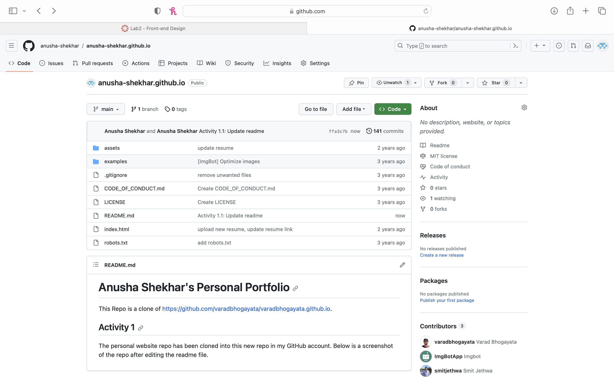
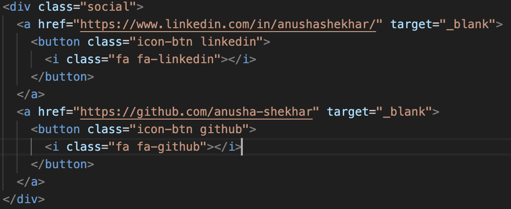
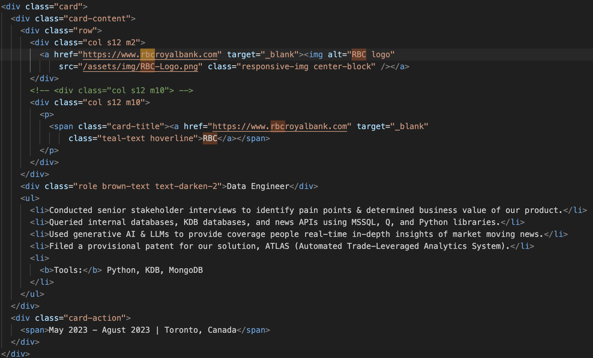
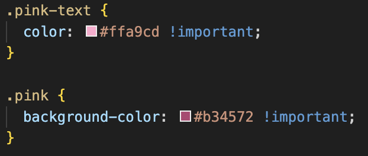
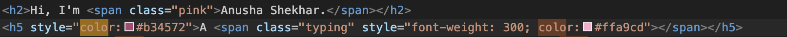
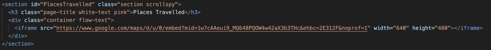
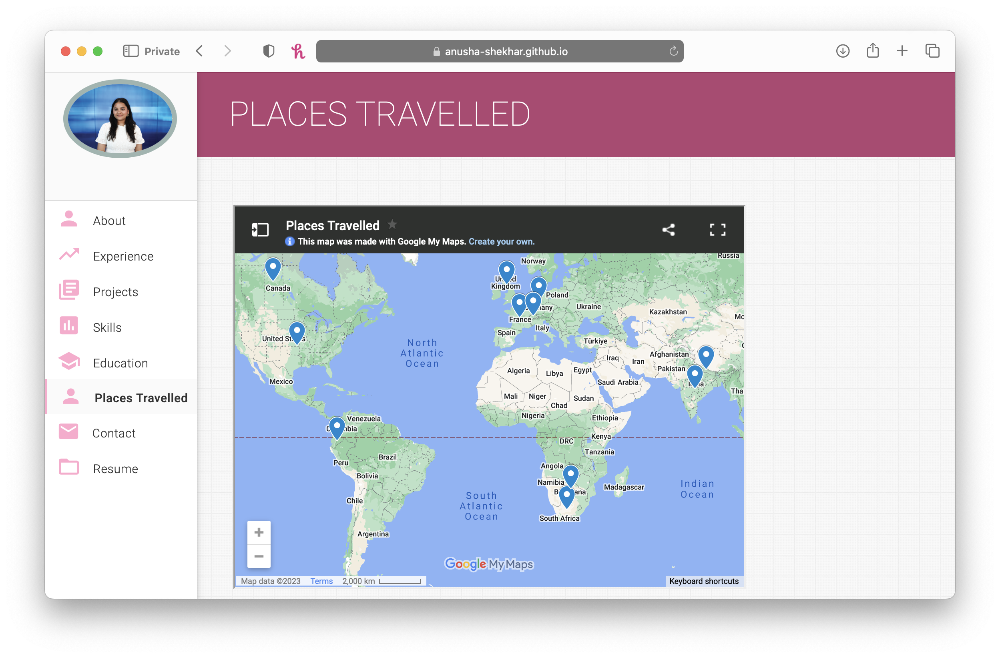

# Anusha Shekhar's Personal Portfolio
This Repo is a clone of https://github.com/varadbhogayata/varadbhogayata.github.io.

## Activity 1
The personal website repo has been cloned into this new repo in my GitHub account. Below is a screenshot of the repo after editing the readme file.

## Activity 2
Information in all sections have been replaced with my personal information. Below are screenshots for some of these sections.

The repo has been deployed using GitHub pages and can be visited at anusha-shekhar.github.io. Below are screenshots showing the webpage.

## Activity 3
The green theme of the original website has been replaced by a pink theme of my choosing. Below are screenshots of various parts of the repo where I have made the changes.

Below is a screenshot of the homepage of the deployed website.

## Activity 4
A new section called "places travelled" has been created and added to the navigation bar on the left. In this section, a google map has been embedded showing all the places I have visited so far. Below is a screenshot from the repo of where I have implemented this.

Below is a screenshot of the Places Travelled Section of the webpage.
